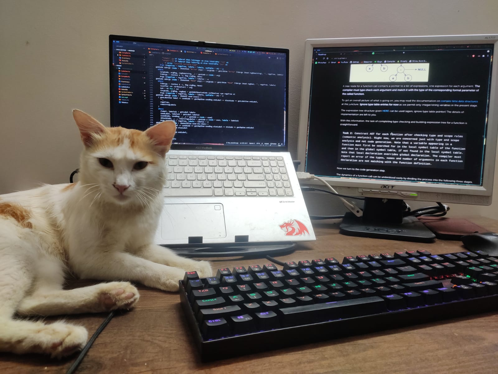

# ExpL

This repository contains my implementation of ExpL(Experimental Language) done as part of the Compiler Laboratory course I took in 2022.

The compiler was written in Haskell using the [Alex](https://www.haskell.org/alex/) lexer and [Happy](https://www.haskell.org/happy/) parser.

It compiles the source language ExpL(spec [here](https://silcnitc.github.io/expl.html) and [here](https://silcnitc.github.io/oexpl-specification.html)) to the low-level XSM (eXperimental String Machine) machine code (ABI [here](https://silcnitc.github.io/abi.html)) which runs on ExpOS (Experimental Operating System) a simulator for which can be found [here](https://silcnitc.github.io/install.html#navxsm).

The project is divided into 8 incremental stages and as such, the repository has a folder which contains the state of the project at the end of each stage. The stages are as follows:

1. Arithmetic Expressions
2. Static Storage Allocation
3. Flow Control Statements
4. User Defined Variables and Arrays
5. Functions
6. User-defined Types and Dynamic Memory Allocation
7. Objects – Data Encapsulation
8. Inheritance and Sub-type Polymorphism

More details about the project can be found on the [website](https://silcnitc.github.io/).

(Special acknowledgement to my cat Cookie for all the help he did me being my rubber duck throughout the implementation of this.)

